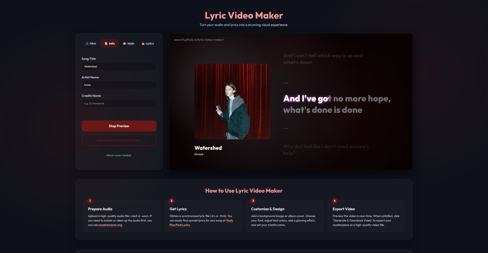

# 🎵 Lyric Video Maker

> Turn your audio and lyrics into a stunning visual experience in seconds—right inside your browser. 🚀

> https://zexerif.github.io/lyric-video-maker/

**Lyric Video Maker** is a premium, client-side web application designed to generate beautiful lyric videos from synchronized lyrics (`.lrc` or word-by-word `.ttml` files) and audio tracks. With customizable visuals, smooth animations, and zero server-side rendering, you can generate stunning music videos instantly.

---

## 📸 Demo

---

## ✨ Features

- **Word-by-Word Sync Animation**: Seamless support for word-by-word karaoke-style animations using `.ttml` (with intelligent spacing adjustments).
- **Dynamic Background Styles**:
  - *Gradient Pulse*: A slowly shifting, vibrant visual gradient.
  - *Lyric Reactive*: Visuals that shift in real-time alongside song progress.
  - *Blurred Album Cover*: A sleek, modern frosted-glass blur styling.
- **Customizable Typography & Colors**: Adjust fonts (Outfit, Inter, Roboto, Playfair), text colors, and custom glowing neon accents.
- **Dynamic Watermark & Credits**: Add customizable bottom-left video credits, with a sleek watermark reference.
- **Real-Time Live Lyric Editor**: Edit lyrics or adjust timestamps on the fly and watch the preview update instantly.
- **100% Client-Side**: Audio and video processing happens entirely in your browser. Your files are never uploaded to any server.

---

## 🛠️ Helpful Resources

- **Audio Isolation**: Need to extract vocals or instrumentals? Use [vocalremover.org](https://vocalremover.org).
- **Lyric Finder**: Find synchronized LRC or TTML lyric files for any song at [Youly Plus Find Lyrics](https://youlyplus.prjktla.my.id/findlyrics.html).

---

## 🚀 How to Use

1. **Upload Audio**: Drop or select your `.mp3` or `.wav` file.
2. **Upload Lyrics**: Drop or select your `.lrc` or `.ttml` file. You can also paste lyrics directly into the Live Editor.
3. **Customize Layout**: Add a background image, upload an album cover, select your font, text color, and neon glow.
4. **Export**: Preview the video in real-time, then click **Generate & Download Video** to export your masterpiece as a high-quality video file.

---

## ⚖️ Disclaimers

- **Piracy**: This application does not condone piracy. Please ensure you own the rights to, or have explicit permission to use, any audio files uploaded to this service.
- **AI Attribution**: This tool was created with the assistance of AI during parts of the design and creation process.
